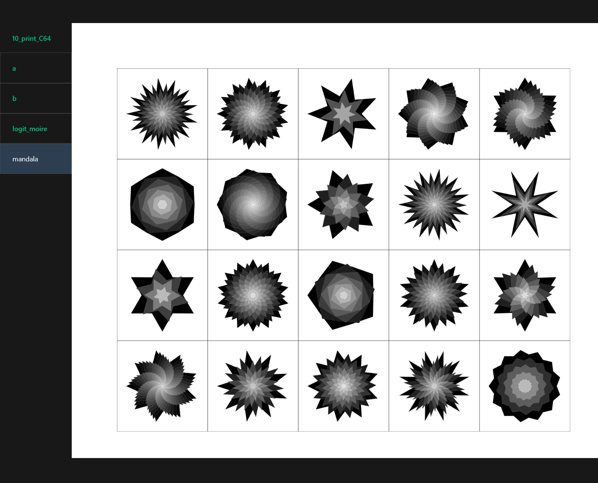

# A p5js editor in VS code

A boilerplate project for a better p5js authoring experience. Basically it opens a Vue application in your browser and allows quick switching between sketchs. New sketchs (.vue files in the `views` folder) are automatically added to the navigation bar in Vue.

Motivation: There are other boilerplates out there, but they necessitate to duplicate a whole new project for each experiment.

# Setup
1. Clone.
2. `npm install`.
3. Accept to install the file watching extension VS Code is suggesting.
4. `chmod u+x new_files.sh`.
5. Run Vite.
6. You can create .vue and use the snippet "p5".

# Warning

Work in progress. Especially, the live-reloading may be not cross-platform.

Known limit: deletion of files is detected only if the deletion in done in the explorer sidebar in VS Code.

